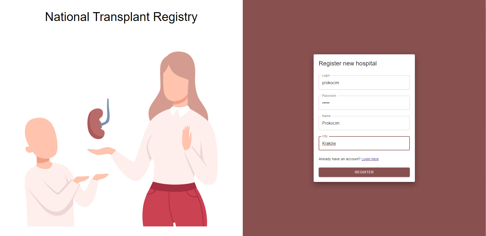

# Transplant Registry

## Opis projektu

Celem projektu było stworzenie portalu dla sieci szpitali, który umożliwia wymianę informacji o organach dostępnych do przeszczepów oraz o potrzebach przeszczepów konkretnych organów. Szpitale rejestrując się do systemu uzyskują możliwość przeglądania list aktualnie dostępnych organów (zakładka `ORGANS`)oraz zgłoszonych potrzeb przeszczepów (zakładka `REQUESTS`). Kluczową funkcjonalnością aplikacji jest system dopasowań organów do zgłoszonych potrzeb przeszczepu - podczas dodawania organu lub potrzeby przeszczepy system automatycznie sprawdza czy w bazie występują dopasowania, bazując na typie organu oraz na parametrze HLA (ludzkie antygeny leukocytarne), który dla uproszczenia przyjęty został jako typ wyliczeniowy 4 wartości (A, B, C, D). Przy znalezieniu dopasowania uwzględnjącego priorytety potrzeb przeszczepu, system tymczasowo blokuje parę organ - zapytanie o organ ustawiąjąc im odpowiednie statusy. Dzięki takiemu zabiegowi organy dopasowane do potrzeb o wysokim priorytecie nie będą uwzględniane przy wyszukiwaniu dopasowań na przyszłych operacji. 

Znalezione dopasowania widoczne są w zakładce `MATCHES`. Dostępne są dla nich dwie akcje:
* zaakceptowanie - równoznaczne z wziąciem organu do przeszczepu
* odrzucenie - zrezygnowanie z zarezerwowanego organu, wówczas staje sie on ponownie dostepny dla innych dopasowań

Dodatkowo na każdej liście w celach informacyjnych widoczne są historyczne rekordy, które zostały delikatnie wyszarzone oraz zablokowane są dla nich akcje w przypadku dopasowań.

## Interfejs

<!-- Strona logowania


Strona rejestracji szpitala



Widok listy organów zarejestrowanych w systemie


Widok listy organów zarejestrowanych w systemie


Widok listy dopasowań organów do zapytań dla zalogowanego szpitala


Widok modalu do dodawania organu


Widok modalu do dodawania zapytania o organ

 -->

## Schemat Bazy Danych

W bazie dancyh zdefiniowane są 4 encje, połączone podstawowymi relacjami:


Definicje enumów:

```ts
enum OrganType {
  Kidney = 'KIDNEY',
  Lung = 'LUNG',
  Heart = 'HEART',
  Liver = 'LIVER',
}

enum HLA {
  A = 'A',
  B = 'B',
  C = 'C',
  D = 'D',
}

enum PatientPriority {
  Critical = 3,
  Normal = 2,
  Low = 1,
}

enum OrganMatchStatus {
  Accepted = 'ACCEPTED',
  Pending = 'PENDING',
  Rejected = 'REJECTED',
}

enum OrganStatus {
  Available = 'AVAILABLE',
  Matched = 'MATCHED',
  Taken = 'TAKEN',
}

enum OrganRequestStatus {
  Fulfilled = 'FULFILLED',
  Matched = 'MATCHED',
  Waiting = 'WAITING',
}
```

## API

> Wszystkie endpointy poza `/auth/login` i `/auth/register` są prywatne i wymagają ustawienia tokenu JWT w nagłówku `Authorization` zapytań HTTP:
  ```
  headers: {
    ...
    "Authorizaton": "Bearer <TOKEN>"
  }
  ```
### Moduł autentykacji

* **POST** `/auth/register` - rejestracja nowego szpitala w systemie
  ```
  {
    "city": String
    "name": String
    "login": String
    "password": String
  }
  ```

* **POST** `/auth/login` - zalogowanie się na konto szpitala
  ```
  {
    "login": String
    "password": String
  }
  ```

* **GET** `/auth/profile` - pobranie informacji o szpitalu na podstawie tokenu jwt

### Moduł szpitali

* **GET** `/hospitals` - lista szpitali zarejestrowanych w systemie

* **GET** `/hospitals/:id` - pobranie szczegółowych informacji o szpitalu o zadanim id

* **DELETE** `/hospitals/:id` - usunięcie szpitala (niedostępne z poziomu aplikacji klienta)

### Moduł organów

* **POST** `/organs` - rejestracja nowego organu dostepnego do przeszczepu

  ```
  {
    "organ": OrganType
    "hla": HLA
  }
  ```

* **GET** `/organs` - pobranie listy organów

* **GET** `/organs/:id` - pobranie szczegółowych informacji o organie

* **DELETE** `/organs/:id` - usunięcie organu

### Moduł zapytań o organy (pacjentów oczekujacych na przeszczeb)

* **POST** `/organ-requests` - rejestracja nowego zapytania

  ```
  {
    "organ": OrganType;
    "hla": HLA;
    "priority": PatientPriority;
  }
  ```

* **GET** `/organ-requests` - pobranie listy zapytań

* **GET** `/organ-requests/:id` - pobranie szczegółowych informacji o zapytaniu

* **DELETE** `/organ-requests/:id` - usunięcie zapytania o organ

### Moduł dopasowań organów do zapytań

* **GET** `/organ-matches` - lista dopasowań organów do zapytań

* **PUT** `/organ-matches` - zmiana statusu dopasowania (akceptacja/odrzucenie)
  ```
  {
    "status": OrganMatchStatus
  }
  ```

## Aplikacja serwera

Aplikacja serwera została wykonana przy pomocy typescriptowego frameworku NestJS, który jest silnie wzorowany na architekturze Spring-a oraz Angular-a.

Wykorzystany został klasyczny model warstwowy obsługi zapytania:
* Controller - obsługa routingu, parsowanie parametrów, validacja dancyh na podstawie zadanego DTO (Data Transfer Object), delegacja obsługi zapytania do serwisu.

* Service - warstwa logiki biznesowej aplikacji, medoty serwisu od kontrolera odbierają czyste i wstępnie zwalidowane dane aby następnie za pomocą sekwencji operacji na innych serwisach oraz repozytoriach wykonać swoje zadanie.

* Repository - zarządza obiektami `Entity`, które odwzorowują tabele wraz z relacjami z bazy danych na obiekty w języka programowania. Udostepnia szereg popularnych metod, w tym query builderów oraz runnerów pozwalających budowanie dostosowanych do własnych potrzeb zapytań oraz transakcji.


Wspomniane wcześniej DTO to po prostu klasy z odpowiednymi dekoratorami przy polach. Niezastąpiony duet bibliotek `class-validator` + `class-transformer` wraz z wbudowanymi w NestJS mechanizmami pozwala w bardzo prosty sposób zadeklarować zasady walidacji poszczególmnych pól i w sposób automatyczny je zaaplikować na poziomie kontrolera:

`create-hospital.dto.ts`
```ts
class CreateHospitalDto {
  @IsNotEmpty ()
  name: string;

  @IsNotEmpty()
  city: string;

  @IsNotEmpty()
  login: string;

  @IsNotEmpty()
  @MinLength(7)
  password: string;
}

```

`auth.controller.ts`
```ts
@Controller('auth')
class AuthController {
  ...

  @Public()
  @Post('register')
  async register(@Body() createHospitalDto: CreateHospitalDto) {
    ...
  }
}

```

Jeśli ciało zapytania nie spełni reguł walidacji, serwer automatycznie odpowie kodem 400 a w odpowiedzi zawrze listę niespełnionych warunków walidacji.

Podobnie jak Spring tak i NestJS silnie bazuje na mechaniźmie Dependency Injection. Doskonale jest on widoczny w warstwie serwisów, gdzie zależnie od potrzeb wstrzykiwane są repozytoria oraz inne serwisy:

```ts
@Injectable()
export class OrganRequestsService {
  constructor(
    @Inject(forwardRef(() => OrgansService))
    private readonly organsService: OrgansService,
    @InjectRepository(OrganMatch)
    private organMatchesRepository: Repository<OrganMatch>,
    @InjectRepository(OrganRequest)
    private organRequestsRepository: Repository<OrganRequest>,
    private dataSource: DataSource,
  ) {}
```

W zamieszczonym fragmencie kodu widzimy przykład zapobiegania problemowi `Circular Dependency` poprzez wstrzyknięcie przekazania referencji.

## Aplikacja klienta

## Technologie

### Aplikacja klienta
* React
* MaterialUI

### Aplikacja serwera
* NestJS
* TypeORM
* PassportJS

### Baza danych
* PostgreSQL

### Wdrożenie i hosting

Aplikacja klienta hostowana jest przy pomocy `github-pages`.

Aplikacja serverwa wdrożona została na serwis `Heroku` poprzez integrację serwisu z repozytorium na Githubie.

Jako provider bazy dancyh wykorzystany został serwis  ElephantSQL.
